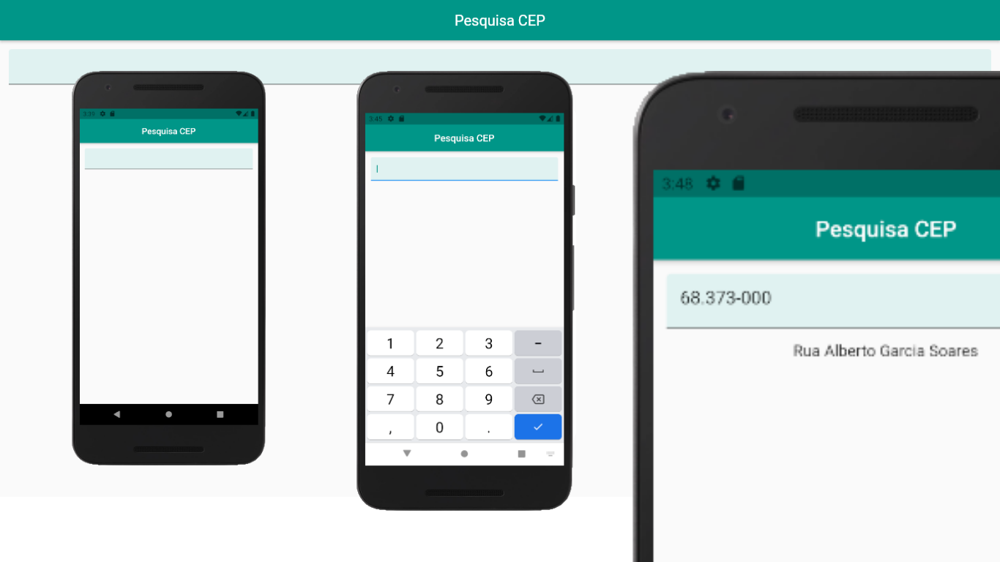

<h1 align="center"> Busca CEP </h1>

<h2 align="center"> Descrição do Projeto </h2>

 
Aplicativo simples feito em flutter para buscar CEP.

<h2 align="center"> Tela Principal do App </h2>
<h1 align="center">
  
</h1>